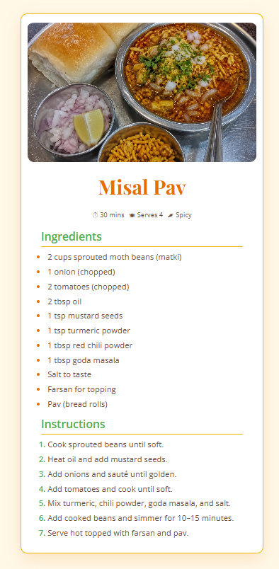

# 🍽️ Recipe Web Page

A responsive recipe webpage built with **HTML5** and **CSS3** featuring a clean layout, elegant typography, and a visually appealing recipe card design.

## ✨ Features

- Responsive recipe card layout
- Attractive typography using Google Fonts
- Smooth hover effects
- Styled ingredients and instructions lists
- Clean and modern UI
- Mobile-friendly design

## 🛠️ Technologies Used

- HTML5
- CSS3
- Google Fonts

## 📚 What I Learned

- Structuring content using semantic HTML
- Creating responsive card layouts with CSS
- Using Flexbox for layout alignment
- Styling lists with custom markers
- Working with images and relative file paths
- Using transitions and hover effects
- Organizing CSS with meaningful comments

## 🚀 Live Demo

🔗 https://shadowmask86.github.io/Recipe-Web-Page/

## 📸 Screenshot



## 🔮 Future Improvements

- Add nutrition information
- Include multiple recipes
- Add dark mode
- Add search and filter functionality
- Convert into a dynamic recipe app using JavaScript

## 💻 How to Run Locally

```bash
git clone https://github.com/ShadowMask86/Recipe-Web-Page.git
cd Recipe-Web-Page
```

Open `index.html` in your browser.

## 👤 Author

**Shreyash**

GitHub: https://github.com/ShadowMask86